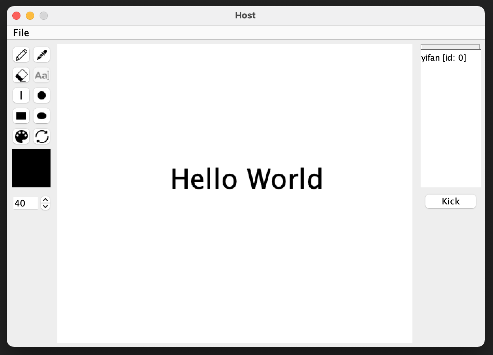

# WhiteBoard 共享白板系统
这是一个由Java编写的共享白板系统，支持功能：

* 画笔和橡皮
* 基本的图形绘制
* 文本的输入和大小调整
* 调色盘和着色器
* 文件的打开和保存
* 管理员可以踢人



## 如何启动？

启动Server：

```shell
java -jar server.jar address port username
```
启动Client：

```shell
java -jar client.jar address port username
```

